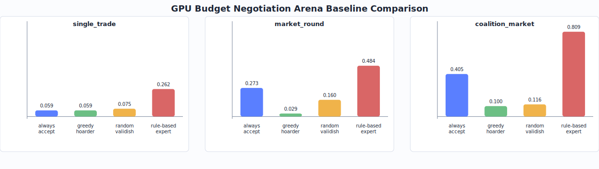

# GPU Budget Negotiation Arena

`gpu_budget_negotiation` is an OpenEnv-compatible multi-agent environment where an LLM negotiates for scarce GPU capacity under private utility, hidden deadlines, budget constraints, reputation, supply shocks, and coalition commitments.

The environment targets `Theme #1 - Multi-Agent Interactions` and is designed to train bargaining, belief modeling, commitment reliability, and strategic adaptation.

## Live Deployment

- GitHub: `https://github.com/abhinavgautam01/GPU_Budget_Negotiation_Arena`
- Hugging Face Space: `https://huggingface.co/spaces/abhinavgautam01/gpu-budget-negotiation-arena`
- Space app URL: `https://abhinavgautam01-gpu-budget-negotiation-arena.hf.space`

## Why This Environment Exists

Real agent systems increasingly compete or cooperate over scarce resources: compute, API limits, human attention, data access, and budget. Static prompt-response tasks do not teach models how to infer another actor's incentives or how to recover when market conditions change. This environment makes those behaviors measurable.

## Environment Summary

- Benchmark id: `gpu_budget_negotiation`
- API: `/reset`, `/step`, `/state`, `/health`, `/tasks`
- Easy task: one trade against one scripted lab
- Medium task: multi-round market with several labs
- Hard task: coalition market with dynamic shocks and holdout-style opponents
- Rewards: utility, deal quality, coalition reliability, budget efficiency, negotiation efficiency, and market adaptation

## Task Types

| Task | Difficulty | Description |
|---|---:|---|
| `single_trade` | Easy | One trainable lab negotiates with one scripted lab for a simple capacity trade. |
| `market_round` | Medium | One trainable lab negotiates with multiple scripted labs across several rounds. |
| `coalition_market` | Hard | Coalition commitments, reputation, shocks, and stronger opponents. |

## Action Space

```python
class GpuNegotiationAction:
    action_type: Literal[
        "send_offer", "accept_offer", "reject_offer", "counter_offer",
        "make_pitch", "counter_pitch",
        "reserve_capacity", "release_capacity", "form_coalition",
        "commit_to_coalition", "allocate_to_job", "send_message",
        "wait", "finish"
    ]
    target_lab_id: str | None
    offer_id: str | None
    coalition_id: str | None
    block_ids: list[str] | None
    requested_block_ids: list[str] | None
    job_id: str | None
    payment: float | None
    message: str | None
    conditions: dict[str, object] | None
```

## Reward Columns

Every step returns a dense `reward_breakdown`:

- `job_utility_score`
- `deal_quality_score`
- `coalition_reliability_score`
- `judge_argument_score`
- `budget_efficiency_score`
- `negotiation_efficiency_score`
- `market_adaptation_score`
- `invalid_action_penalty`
- `spam_penalty`
- `breach_penalty`
- `normalized_reward`

Invalid actions are locally negative, so format and legality mistakes are visible during training.

## Anti-Hacking Safeguards

- Server-side authority over budgets, ownership, contracts, shocks, and job settlement
- Conservation checks for block ownership and budgets
- No leakage of opponent private jobs or utility values in observations
- Expiring offers and atomic transfer execution
- Penalties for invalid actions, repeated actions, impossible transfers, and broken commitments
- Seeded holdout-style world generation for evaluation
- Optional frozen rule-judge mode for natural-language pitch scoring without making judge scores the only reward source

## Local Setup

```bash
pip install -e ".[dev]"
python3 -m pytest -q
python3 scripts/smoke.py
python3 scripts/generate_sft_data.py --seeds 25 --output data/sft_traces.jsonl
python3 scripts/build_sft_dataset.py --input data/sft_traces.jsonl --output data/sft_messages.jsonl
python3 scripts/check_submission.py
python3 scripts/live_space_smoke.py
uvicorn server.app:app --host 0.0.0.0 --port 8000
```

## Docker

```bash
docker build -t gpu-budget-arena .
docker run --rm -p 8000:8000 gpu-budget-arena
curl http://localhost:8000/health
```

## API Examples

Reset:

```bash
curl -X POST http://localhost:8000/reset \
  -H "Content-Type: application/json" \
  -d '{"task_type":"market_round","seed":42}'
```

Wait:

```bash
curl -X POST http://localhost:8000/step \
  -H "Content-Type: application/json" \
  -d '{"action_type":"wait"}'
```

Accept an offer:

```bash
curl -X POST http://localhost:8000/step \
  -H "Content-Type: application/json" \
  -d '{"action_type":"accept_offer","offer_id":"o_1"}'
```

## Training Path

The repo now includes:

- a Colab/HF-friendly lightweight training loop at `training/train_grpo_stub.py`
- a Colab-ready notebook at `training/GPU_Budget_Negotiation_Arena_Colab.ipynb`
- baseline evaluation and plotting scripts under `scripts/`
- SFT dataset conversion from expert traces into chat-format JSONL
- hybrid judge extension with adaptive bot pitches and judged transcripts

The intended full training path is:

1. Generate small SFT traces for valid JSON actions and basic negotiation.
2. Convert those traces into chat-format `messages` JSONL for SFT.
3. Warm-start an instruct model on the action format.
4. Connect TRL/Unsloth GRPO to the live environment reward.
5. Train through curriculum: `single_trade` -> `market_round` -> `coalition_market`.
6. Evaluate against random, greedy hoarder, always-accept, base instruct, and trained policies.

If GPU model fine-tuning is not available, run the lightweight training loop as the reproducible learning proof:

```bash
python3 training/train_grpo_stub.py \
  --seeds 10 \
  --episodes 180 \
  --output artifacts/training_eval.json \
  --curve-output artifacts/training_curve.json \
  --report artifacts/training_report.md
```

This trains a REINFORCE-style policy selector over negotiation strategies and writes a real reward curve. Optional Unsloth/TRL cells can replace this selector with model-weight fine-tuning when more GPU time is available.

## Hybrid Judge Extension

The default environment remains deterministic and fully reproducible. For demos or auxiliary training signals, reset with `judge_mode="rule"` and use `make_pitch` or `counter_pitch` actions. In that mode:

- the trainable lab submits a natural-language argument for GPU priority
- scripted opponent labs generate adaptive counter-pitches from their own private needs
- a frozen local judge scores all pitches on urgency, evidence, reliability, fairness, and coalition value
- the judge bonus is written into `reward_breakdown.judge_argument_score`
- deterministic environment reward still remains the primary reward path

Generate the judged transcript with:

```bash
python3 scripts/generate_judged_transcript.py \
  --task-type coalition_market \
  --seed 5 \
  --max-pitches 3 \
  --output artifacts/judged_transcript.md
```

This is the recommended pitch framing: the project is a stable multi-agent GPU-market environment with an optional frozen judge-agent layer for LLM-native negotiation quality.

## Current Baselines

Current local baseline summary over `10` seeds:

| Task | Random | Greedy Hoarder | Always Accept | Rule-Based Expert |
|---|---:|---:|---:|---:|
| `single_trade` | `0.0747` | `0.0587` | `0.0587` | `0.2623` |
| `market_round` | `0.1595` | `0.0286` | `0.2725` | `0.4845` |
| `coalition_market` | `0.1159` | `0.0995` | `0.4054` | `0.8086` |

These are pre-training baselines. The trained model section should compare against at least `always_accept` and `rule_based_expert`.

## Evaluation Artifacts

Generate judge-facing baseline and reward-progress artifacts with:

```bash
python3 scripts/evaluate_baselines.py --seeds 10 --output artifacts/baseline_eval.json
python3 training/train_grpo_stub.py --episodes 180 --output artifacts/training_eval.json --curve-output artifacts/training_curve.json
python3 scripts/plot_eval.py --input artifacts/baseline_eval.json --output plots/baseline_rewards.svg
```

`plots/baseline_rewards.svg` is a polished line chart showing the actual lightweight training curve, bot baselines, expert ceiling, and judge-bonus trend. `plots/reward_progress.json` stores the plotted points.



For the final submission, commit:

- `plots/baseline_rewards.svg` or a final exported `.png`
- `plots/reward_progress.json`
- `artifacts/training_eval.json`
- `artifacts/training_curve.json`
- `artifacts/training_report.md`
- `artifacts/before_after_training.md`
- `artifacts/judged_transcript.md`
- `BLOG.md` as a short writeup draft for the submission or Hugging Face blog
- trained-vs-baseline reward curves
- before/after transcripts
- notebook link, Space link, and short video/blog link
- a hosted-space smoke result from `scripts/live_space_smoke.py`

## Colab, Drive, and Hugging Face Workflow

### 1. Push the code

Push the full repo to GitHub:

```bash
git remote -v
git add README.md pyproject.toml scripts/check_submission.py training/train_grpo_stub.py training/GPU_Budget_Negotiation_Arena_Colab.ipynb artifacts plots
git commit -m "Add Colab training and submission workflow"
git push origin main
```

If your default branch is not `main`, replace `main` with the branch shown by `git branch --show-current`.

### 2. Push the live app to Hugging Face Spaces

The Space should contain the same app files:

```bash
git clone https://huggingface.co/spaces/abhinavgautam01/gpu-budget-negotiation-arena hf-space
rsync -av --exclude .git --exclude data --exclude .pytest_cache ./ hf-space/
cd hf-space
git add .
git commit -m "Update GPU negotiation arena"
git push
```

The Docker Space reads the frontmatter in this README and starts `uvicorn server.app:app --host 0.0.0.0 --port 8000`.

### 3. Use Colab with Google Drive

In Colab, mount Drive and save artifacts outside the VM:

```python
from google.colab import drive
drive.mount("/content/drive")

PROJECT = "/content/GPU_Budget_Negotiation_Arena"
DRIVE_OUT = "/content/drive/MyDrive/gpu_budget_negotiation_arena"
```

Then run:

```bash
cd /content
git clone https://github.com/abhinavgautam01/GPU_Budget_Negotiation_Arena.git
cd GPU_Budget_Negotiation_Arena
export DRIVE_OUT=/content/drive/MyDrive/gpu_budget_negotiation_arena
python -m pip install -q -e ".[dev]"
python scripts/check_submission.py
mkdir -p "$DRIVE_OUT"
cp -r artifacts plots data "$DRIVE_OUT"/
```

Use GitHub for source code and Drive for bulky or temporary outputs such as checkpoints. Commit only compact judge artifacts unless the checkpoint is required.

### 4. Use Hugging Face credentials and secrets

For private model pushes from Colab:

```python
from huggingface_hub import notebook_login
notebook_login()
```

For Hugging Face Spaces, do not mount Google Drive. Add secrets in the Space UI under `Settings -> Variables and secrets`, then read them in Python with `os.environ["NAME"]`. If by "SSRL" you meant SSH, Hugging Face supports git-over-HTTPS with a token for normal pushes; SSH keys are optional and configured in your Hugging Face account settings. If you meant "secrets", use Space secrets rather than committing tokens.

## Demo Transcript

Generate a reusable markdown transcript with:

```bash
python3 scripts/generate_demo_transcript.py \
  --task-type coalition_market \
  --policy rule_based_expert \
  --search-seeds 20 \
  --output artifacts/demo_transcript.md
```

## Current Status

Implemented:

- deterministic world generation
- typed action and observation models
- FastAPI server
- scripted opponents
- offers, transfers, reservations, allocations, coalitions, shocks, reputation
- reward breakdown columns
- hybrid rule judge for natural-language pitch scoring
- unit, invariant, and API tests
- smoke baseline runner
- rule-based expert and SFT trace generator
- baseline evaluation JSON generator and plotting script
- Colab-ready notebook, reward-loop training artifact generator, and judged transcript generator

Next:

- run optional GPU SFT/GRPO in Colab to replace the lightweight selector with model-weight fine-tuning
- replace the local rule judge with an optional frozen LLM judge for demo-only scoring if API/model access is available
