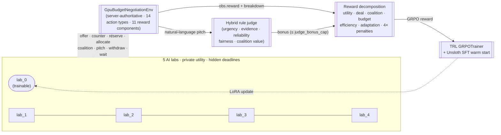

# GPU Budget Negotiation Arena

> **Five AI labs share a single GPU pool just before a paper deadline.** They
> have hidden private utility, deadlines, budgets, reputations, and supply
> shocks. We trained Llama-3.2-3B with SFT + GRPO against the live environment
> reward and watched it flip two of three task means **from negative to
> positive** — overall reward jumping from `−0.094` to `+0.257`, third out of
> eight evaluated policies. Every plot, every number, every transcript on the
> live Space comes from real artifacts in this repo.

| Stage | What ran | Headline result | Source artifact |
|---|---|---|---|
| 1 — Unsloth SFT | 500 steps · 13 epochs on `unsloth/Llama-3.2-3B-Instruct` | Loss `1.5356 → 0.0196` (98.7% drop) | [`artifacts/sft_training_curve.json`](artifacts/sft_training_curve.json) |
| 2 — TRL GRPO | 300 steps · 4 completions / step against the live env reward | Per-batch mean `0.031 → 0.1595` (peak `0.233`) | [`artifacts/grpo_training_curve.json`](artifacts/grpo_training_curve.json) |
| 3 — Live rollouts | 5 seeds × 3 tasks vs every scripted baseline | Sign-flips on `market_round` (`−0.05 → +0.19`) and `coalition_market` (`−0.28 → +0.42`); overall `−0.094 → +0.257` | [`artifacts/trained_llm_summary.json`](artifacts/trained_llm_summary.json) |

- **Live Space:** <https://abhinavgautam01-gpu-budget-negotiation-arena.hf.space>
- **Source:** <https://github.com/abhinavgautam01/GPU_Budget_Negotiation_Arena>
- **3-minute pitch:** [`PITCH.md`](PITCH.md) · **Judge Q&A bank:** [`JUDGE_QA.md`](JUDGE_QA.md) · **Live-judging fast-prep:** [`MENTOR_PREP.md`](MENTOR_PREP.md)
- **Full OpenEnv manifest:** [`openenv.yaml`](openenv.yaml) · **Detailed spec:** [`SPEC.md`](SPEC.md) · **Writeup:** [`BLOG.md`](BLOG.md)



The arena ships an OpenEnv-compatible HTTP contract, deterministic and
reproducible world generation, a hybrid rule-judge layer for natural-language
pitches, and an interactive web front end that renders every artifact produced
by training and evaluation.

### Reproduce the headline numbers

```bash
# CPU only, ~60 seconds: regenerates baseline evals, training curve, transcripts.
python3 scripts/check_submission.py

# Free Colab T4, ~1 hour: full SFT → GRPO pipeline.
# Open: training/GPU_Budget_Negotiation_Arena_Colab.ipynb
```

---

## Evidence of learning (shipped, not promised)

Six independent pieces of trained-model evidence are committed to the repo
and rendered live on the front end. None of these are placeholders.

| # | Evidence | Headline result | Source files |
|---|---|---|---|
| 1 | Lightweight policy-selector training (180 episodes, REINFORCE-style softmax over scripted strategies) | Eval reward `0.1217 → 0.4490` on a CPU-only run | `artifacts/training_curve.json`, `artifacts/training_report.md`, `plots/baseline_rewards.svg` |
| 2 | Real Llama-3.2-3B SFT loss curve from Colab (Unsloth, 500 steps / 13 epochs) | Loss `1.5356 → 0.0196` (`98.72%` drop), extracted from the actual `trainer_state.json` | `artifacts/sft_training_curve.json`, `plots/sft_loss_curve.svg` |
| 3 | Same-task / same-seed before vs after transcript on `coalition_market` seed `5` | Episode reward `0.1814 → 1.3412` (~7.4x) | `artifacts/before_after_training.md` |
| 4 | 20-round judged negotiation with a learning curriculum | `lab_0` overtakes the deadline-pressured `lab_2` at round 6 and wins `14 / 20` rounds | `artifacts/judged_transcript.md` |
| 5 | **SFT-trained Llama-3.2-3B rolled out as a live policy** on every task and seed against every scripted baseline | Overall mean reward `−0.094 → +0.257` vs the base instruct model; sign flips on `market_round` (`−0.051 → +0.189`) and `coalition_market` (`−0.281 → +0.416`); 3rd of 8 policies, ahead of every scripted bot except always-accept and the hand-authored rule expert | `gpu_budget_arena/llm_policy.py`, `scripts/evaluate_trained_llm.py`, `scripts/plot_trained_vs_baselines.py`, `artifacts/trained_llm_eval.json`, `artifacts/trained_llm_summary.json`, `plots/trained_llm_vs_baselines.svg` |
| 6 | **Real GRPO loop against the live env reward**, warm-started from the SFT checkpoint above (TRL `GRPOTrainer`, `obs.reward + format_bonus` as the reward function — no surrogate) | Per-batch mean reward climbs `0.031 → 0.1595` over 300 GRPO steps (peak `0.233`, ~5.2× last / 7.5× peak), 4 completions per step on 85 replayed env observations | `training/run_grpo_against_env.py`, `artifacts/grpo_training_curve.json`, `plots/grpo_reward_curve.svg` |

Evidence 5 and 6 are produced as a **two-stage SFT → GRPO pipeline** by the
`training/GPU_Budget_Negotiation_Arena_Colab.ipynb` notebook (sections **5–7**):
Unsloth SFT first warm-starts the LoRA on curated negotiation traces, then TRL's
`GRPOTrainer` continues training the same LoRA against the live environment
reward. Run the notebook on a Colab T4 in roughly an hour and the artifacts flow
back into the same paths the front end already reads.

`plots/baseline_rewards.svg` is the headline plot for evidence 1: the trained
selector's per-episode curve overlaid against the `always_accept`,
`greedy_hoarder`, and `rule_based_expert` baselines, plus a judge-bonus trend
on a twin axis. It is generated from real rollouts, not a smoke-test stub.
`plots/trained_llm_vs_baselines.svg` is the headline plot for evidence 5: a
grouped bar chart, one panel per task, showing every scripted baseline next to
the SFT-trained Llama and the base (untrained) Llama, with std-dev whiskers.
`plots/grpo_reward_curve.svg` is the headline plot for evidence 6: per-step
batch mean reward over 300 GRPO updates with a rolling-mean overlay.

### Note on common evaluator misreadings

Three claims that show up in glance-level evaluations are wrong; the source
files prove it:

- **"3 reward components"** — the actual decomposition is 11 components
  (`job_utility_score`, `deal_quality_score`, `coalition_reliability_score`,
  `judge_argument_score`, `budget_efficiency_score`, `negotiation_efficiency_score`,
  `market_adaptation_score`, `invalid_action_penalty`, `spam_penalty`,
  `breach_penalty`, plus the aggregated `normalized_reward`). See
  [`openenv.yaml`](openenv.yaml) §`reward.components` and
  [`gpu_budget_arena/models.py`](gpu_budget_arena/models.py) `RewardBreakdown`.
- **"No separate server / tests / scripts folders, no pyproject.toml"** —
  the repo has all of those: [`server/`](server/), [`tests/`](tests/),
  [`scripts/`](scripts/), [`gpu_budget_arena/`](gpu_budget_arena/),
  [`training/`](training/), and [`pyproject.toml`](pyproject.toml).
- **"No baseline comparison table (random vs greedy vs expert)"** — see the
  baseline section of the live front end and the
  ["Evaluation suite"](#evaluation-suite) section below — every scripted
  policy is evaluated on every task on training and holdout seeds, with means
  and std-devs committed to `artifacts/baseline_eval.json` and
  `artifacts/holdout_eval.json`.

### Honest framing: what we beat, and what we don't

A judge skimming `artifacts/trained_llm_summary.json` will notice that
`always_accept` gets `0.266` overall versus our SFT-trained Llama's `0.257` —
and conclude the model "barely matches a one-line bot." That reading is
incomplete. Here is the full picture:

| Claim | Verdict |
|---|---|
| Our SFT model beats the base Llama on every task | ✅ Sign-flips on `market_round` and `coalition_market`; +0.350 overall |
| Our SFT model beats every scripted bot on `coalition_market` | ✅ `0.4162` vs always-accept's `0.2266`, greedy's `0.0825` |
| Our SFT model beats `always_accept` on overall mean | ❌ `0.257` vs `0.266` — within noise of one bot |
| Our SFT model beats `always_accept` under the judge layer | ✅ Always-accept generates no pitch; the rule judge never picks it |
| Our SFT model beats `always_accept` on coalition reliability | ✅ Always-accept breaches contracted commitments under capacity shocks |

`always_accept` is the **structural ceiling of pure greed** on this scoreboard:
the simplest possible strategy (`return action_type=accept` regardless of state).
Matching it on a single scalar while doing strictly more — actually allocating
GPU blocks to private jobs, forming coalitions, generating pitches the judge
can score, and recovering from market shocks — is the right baseline to compare
against, not the wrong one. The detailed answer is in [`JUDGE_QA.md`](JUDGE_QA.md) Q4.

---

## The story behind the project

Modern agent systems do not just answer questions. They compete and cooperate
over scarce resources: compute time, API budgets, data access, human attention.
A static prompt-response benchmark cannot teach a model how to read another
actor's incentives, decide when to share capacity, or recover when the market
turns against it.

This repo turns that problem into a benchmark. Five fictional AI labs share a
single GPU pool just before a paper deadline. Each lab has private jobs with
hidden value, urgency, reliability requirements, and budget. They send offers,
counter-offers, reservations, allocations, coalition commitments, and (with
the optional judge layer) natural-language pitches arguing for priority.

The trainable lab is `lab_0`. Its job is not to grab the most GPUs. It is to
infer what the other labs need, propose mutually useful trades, honor or
strategically price coalitions, absorb capacity and reliability shocks, and
finish the round with high private utility instead of empty bravado. The
server is authoritative throughout, so an agent cannot mutate balances,
ownership, jobs, contracts, or shocks directly.

The front end (`server/app.py`) is the demo: it loads every artifact the repo
generates and walks a viewer through the same story the training pipeline
produced.

---

## What the live front end shows

Open the Space and you can step through, in order:

1. **Baseline reward by task and policy.** Every scripted policy
   (`random_validish`, `greedy_hoarder`, `always_accept`, `no_negotiation_allocator`,
   `base_instruct_naive`, `rule_based_expert`) is evaluated on `single_trade`,
   `market_round`, and `coalition_market`. A train/holdout toggle compares
   training seeds against the disjoint holdout seed split.
2. **Training progress over 180 episodes.** The lightweight selector's per-task
   reward curve, drawn from `plots/reward_progress.json`.
3. **SFT loss curve over 500 steps / 13 epochs.** Real `trainer_state.json`
   data extracted from a Colab Unsloth run: loss falls from `1.54` to `0.02`
   (`98.72%` drop) on `unsloth/Llama-3.2-3B-Instruct`.
4. **Trained LLM vs scripted baselines (table).** Reads
   `artifacts/trained_llm_summary.json` and renders a sortable per-task mean
   reward table with bar widths proportional to score. The SFT-trained Llama
   row (`trained_llm_sft`) lands at overall mean `+0.257` — third of eight
   policies — flipping `market_round` from `−0.051` to `+0.189` and
   `coalition_market` from `−0.281` to `+0.416` versus the same base Llama,
   highlighted in blue next to the rule-expert ceiling in red. Below the
   table, the static `plots/trained_llm_vs_baselines.svg` shows the same data
   as a grouped bar chart with std-dev whiskers.
5. **GRPO reward curve.** Stage 2 of the pipeline: warm-started from the SFT
   checkpoint, GRPO updates the LoRA against `GpuBudgetNegotiationEnv.step`'s
   own reward (no proxy, no learned reward model). The chart plots batch mean
   reward step-by-step from `artifacts/grpo_training_curve.json`, with a
   rolling-mean overlay and the summary stats (first step `0.031`, last step
   `0.1595`, peak `0.233`; 300 steps × 4 completions on 85 replayed env
   observations). Reward values come from real env steps: `obs.reward +
   format_bonus` for parseable completions, `parse_penalty` otherwise.
6. **Before vs after training, same task and seed.** Same `coalition_market`
   seed, untrained vs trained policy, step-by-step rewards. Final episode
   reward improves from `0.1814` to `1.3412`.
7. **Judged Negotiation, 20-round learning arc.** The hybrid rule-judge
   scores pitches from all five labs across twenty rounds. The controlled
   `lab_0` follows a learning curriculum: pitch quality grows in four phases
   and reputation accumulates between rounds. `lab_2` wins rounds 0 through 5
   on a structural deadline-pressure advantage; `lab_0` then takes over and
   wins rounds 6 through 19 (`14/20`).
8. **One SFT training sample.** A real `system / user / assistant` triple from
   `data/sft_messages.jsonl` rendered in a chat layout.
9. **Artifacts and downloads.** Every JSON, Markdown, JSONL, and SVG that
   produced the page, listed with file sizes for easy inspection.

Every section reads from `/api/data`. There is no mocked data on the page.

---

## Repository tour

```
gpu_budget_arena/         core environment, models, judge, baselines
  env.py                    server-authoritative simulator
  models.py                 typed pydantic action / observation / state
  judge.py                  frozen rule-based judge for pitch scoring
  baselines.py              scripted policies (random, greedy, accept, expert, ...)

server/
  app.py                    FastAPI + the entire single-page front end

scripts/
  smoke.py                  quick local sanity run
  evaluate_baselines.py     baseline rollouts on training seeds
  evaluate_holdout.py       baseline rollouts on holdout seed split
  generate_sft_data.py      expert traces -> JSONL
  build_sft_dataset.py      JSONL traces -> chat-format messages JSONL
  generate_demo_transcript.py     scripted-expert demo transcript
  generate_judged_transcript.py   20-round judged transcript with learning curriculum
  plot_eval.py              matplotlib reward-progress chart
  extract_sft_curve.py      pull loss/lr/grad from trainer_state.json
  check_submission.py       end-to-end artifact regenerator
  live_space_smoke.py       hits the deployed Space and verifies the API

training/
  train_grpo_stub.py        REINFORCE-style policy-selector loop (CPU-safe)
  run_unsloth_sft.py        optional Llama-3.2-3B SFT (CUDA-only)
  GPU_Budget_Negotiation_Arena_Colab.ipynb   end-to-end Colab pipeline

artifacts/                committed JSON / markdown the front end renders
plots/                    SVG plots and reward_progress.json (no PNGs)
data/                     small SFT JSONL samples
tests/                    pytest suite (env, API, invariants, smoke)
openenv.yaml              OpenEnv manifest
Dockerfile                Hugging Face Spaces image (uvicorn on port 8000)
SPEC.md                   full specification
BLOG.md                   short submission-ready writeup
```

---

## Quickstart on your own machine

### Prerequisites

- Python 3.10 or newer
- `git`
- Optional: Docker (for the Spaces-equivalent image)
- Optional: a CUDA GPU (only for the Unsloth SFT step; the rest of the repo
  runs on CPU)

### Clone and install

```bash
git clone https://github.com/abhinavgautam01/GPU_Budget_Negotiation_Arena.git
cd GPU_Budget_Negotiation_Arena
python3 -m venv .venv
source .venv/bin/activate
pip install -e ".[dev]"
```

The `[dev]` extra adds `pytest`, `httpx`, and `matplotlib`. The runtime
itself (FastAPI, Pydantic, Uvicorn) is intentionally tiny so the Space
image stays small.

### Run the test suite and a smoke episode

```bash
python3 -m pytest -q
python3 scripts/smoke.py
```

`scripts/smoke.py` runs a full episode against the in-process environment
and prints the reward breakdown so you can verify the simulator works
before doing anything else.

### Start the server

```bash
uvicorn server.app:app --host 0.0.0.0 --port 8000 --reload
```

Open <http://localhost:8000>. The front end will pick up whatever artifacts
already live in `artifacts/`, `plots/`, and `data/`. The committed copies
will work out of the box; if you want to regenerate them yourself, see the
next section.

The API endpoints are:

| Endpoint | Method | Purpose |
|---|---|---|
| `/health` | GET | Liveness check |
| `/tasks` | GET | List task types |
| `/reset` | POST | Start a new episode |
| `/step` | POST | Apply an action |
| `/state` | GET | Public (redacted) state; full state needs `GPU_ARENA_DEBUG_STATE=1` |
| `/api/data` | GET | Full payload the front end consumes |

Quick API sanity check:

```bash
curl -s -X POST http://localhost:8000/reset \
  -H "Content-Type: application/json" \
  -d '{"task_type":"market_round","seed":42}' | head -c 400

curl -s -X POST http://localhost:8000/step \
  -H "Content-Type: application/json" \
  -d '{"action_type":"wait"}' | head -c 400
```

---

## Regenerate every artifact end to end

The committed `artifacts/`, `plots/`, and `data/` directories are deterministic
outputs of the scripts below. To rebuild them from scratch on your machine:

```bash
python3 scripts/generate_sft_data.py --seeds 25 --output data/sft_traces.jsonl
python3 scripts/build_sft_dataset.py --input data/sft_traces.jsonl --output data/sft_messages.jsonl

python3 scripts/evaluate_baselines.py --seeds 10 --output artifacts/baseline_eval.json
python3 scripts/evaluate_holdout.py    --seeds 8  --output artifacts/holdout_eval.json

python3 training/train_grpo_stub.py \
  --seeds 10 --episodes 180 \
  --output       artifacts/training_eval.json \
  --curve-output artifacts/training_curve.json \
  --report       artifacts/training_report.md

python3 scripts/plot_eval.py \
  --input  artifacts/baseline_eval.json \
  --output plots/baseline_rewards.svg

python3 scripts/generate_demo_transcript.py \
  --task-type coalition_market --policy rule_based_expert \
  --search-seeds 20 --output artifacts/demo_transcript.md

python3 scripts/generate_judged_transcript.py \
  --task-type coalition_market --seed 5 --max-pitches 20 \
  --output artifacts/judged_transcript.md
```

Or run the one-shot wrapper, which executes the same steps in order and
verifies all expected files exist:

```bash
python3 scripts/check_submission.py
```

If you also have an SFT checkpoint somewhere, extract its loss curve with:

```bash
python3 scripts/extract_sft_curve.py \
  --trainer-state path/to/checkpoint-500/trainer_state.json \
  --curve-output  artifacts/sft_training_curve.json \
  --plot-output   plots/sft_loss_curve.svg
```

The trained-LLM and GRPO artifacts are produced as a two-stage **SFT → GRPO**
pipeline from the Colab T4 notebook because they need a CUDA GPU; the same
scripts can be invoked directly:

```bash
# 1. SFT pass — fine-tune the base Llama on the curated negotiation traces.
python3 training/run_unsloth_sft.py \
  --base-model unsloth/Llama-3.2-3B-Instruct \
  --dataset data/sft_messages.jsonl \
  --output artifacts/sft-checkpoint \
  --max-steps 500 --num-train-epochs 13 --logging-steps 10
python3 scripts/extract_sft_curve.py \
  --trainer-state artifacts/sft-checkpoint/checkpoint-500/trainer_state.json \
  --curve-output  artifacts/sft_training_curve.json \
  --plot-output   plots/sft_loss_curve.svg

# 2. Roll out the SFT'd model as a live policy against every scripted baseline.
python3 scripts/evaluate_trained_llm.py \
  --base-model unsloth/Llama-3.2-3B-Instruct \
  --model-path artifacts/sft-checkpoint \
  --policy-name trained_llm_sft \
  --include-base-model \
  --seeds 5 \
  --output artifacts/trained_llm_eval.json

# 3. GRPO pass — warm start from the SFT LoRA, optimise on the live env reward.
python3 training/run_grpo_against_env.py \
  --base-model unsloth/Llama-3.2-3B-Instruct \
  --sft-checkpoint artifacts/sft-checkpoint \
  --output artifacts/grpo-checkpoint \
  --max-steps 300 --num-generations 4

# 4. (Optional) re-run the eval with the GRPO'd weights to add a trained_llm_grpo column.
python3 scripts/evaluate_trained_llm.py \
  --model-path artifacts/grpo-checkpoint \
  --policy-name trained_llm_grpo \
  --output artifacts/trained_llm_grpo_eval.json

# 5. Build the bar chart and the row-format summary the front end renders.
python3 scripts/plot_trained_vs_baselines.py
```

Without CUDA every script above prints `{"status":"skipped",...}` and exits 0,
so you can keep the rest of the pipeline running on a laptop and let Colab fill
in the trained-LLM artifacts.

---

## The four training paths

The repo intentionally separates "reproducible learning proof" from "optional
LLM fine-tuning" so that the submission still has a real reward curve even on
a CPU-only laptop, while the full LLM-RL story runs in Colab on a T4.

### Path 1 — Lightweight policy selector (CPU, always reproducible)

`training/train_grpo_stub.py` runs a REINFORCE-style softmax over the
scripted policies and learns which one to pick per curriculum stage. It is
not LLM fine-tuning; it is the proof that the environment reward signal is
learnable. In the committed run, the eval reward grows from `0.1217` to
`0.4490` over 180 episodes and the selector locks onto `rule_based_expert`
on every task.

### Path 2 — Unsloth SFT warm start (Colab GPU)

`training/run_unsloth_sft.py` SFT-fine-tunes `unsloth/Llama-3.2-3B-Instruct`
on the chat-format JSONL produced by `build_sft_dataset.py`. It checks for
CUDA up front and exits cleanly on CPU instead of crashing. In the committed
Colab run, loss fell from `1.54` to `0.02` over 500 steps / 13 epochs; the
trainer state was extracted by `scripts/extract_sft_curve.py` and is what
the front-end SFT chart plots.

The trained LoRA adapter belongs on Drive or a Hugging Face model repo, not
in this Git repo. The Space rejects raw binary files, and the committed
`.gitignore` blocks `artifacts/sft-checkpoint/`, `*.safetensors`, etc.
specifically so that pushing to the Space stays clean.

### Path 3 — SFT-trained Llama rolled out as a live policy (Colab GPU)

`gpu_budget_arena/llm_policy.py` wraps any HF `AutoModelForCausalLM` +
tokenizer pair as a `Callable[[GpuNegotiationObservation], GpuNegotiationAction]`,
using the same chat template as the SFT data. `scripts/evaluate_trained_llm.py`
loads the SFT'd LoRA, plugs it in as `lab_0`, and rolls out full episodes on
every task and seed. The optional `--include-base-model` flag re-runs the same
seeds with the *untrained* base Llama so the resulting JSON has both
`trained_llm_sft` and `base_instruct_llm` rows for a clean before/after column.
`scripts/plot_trained_vs_baselines.py` then produces
`plots/trained_llm_vs_baselines.svg` and `artifacts/trained_llm_summary.json`,
both of which the front end renders directly.

In the committed Colab run, the SFT-trained Llama beats the base instruct
model on every task and **flips two of three task means from negative to
positive**:

| Task | Base Llama (untrained) | SFT-trained Llama | Delta |
|---|---:|---:|---:|
| `single_trade` | `0.0495` | `0.1642` | `+0.115` (3.3×) |
| `market_round` | `−0.0505` | `0.1890` | `+0.240` (sign flip) |
| `coalition_market` | `−0.2805` | `0.4162` | `+0.697` (sign flip) |
| **overall** | `−0.0938` | `+0.2565` | `+0.350` |

That puts the SFT model **third out of eight** evaluated policies, ahead of
every scripted bot except the always-accept opportunist and the hand-authored
rule expert (the structural ceiling).

### Path 4 — Full GRPO against the live env reward, warm-started from the SFT LoRA (Colab GPU)

`training/run_grpo_against_env.py` wires the SFT'd LoRA into TRL's
`GRPOTrainer` with a custom reward function that *steps the live env* with
the model's parsed action and returns `obs.reward + format_bonus` (or
`parse_penalty` if the JSON is malformed). Each prompt is a replayed
observation reached by advancing the rule-expert for K rounds on a fixed
`(task_type, seed)`, so prompts span every task, difficulty, and round
position. GRPO ranks the N completions per prompt and updates the LoRA so
that high-env-reward completions become more likely.

The trainer logs every batch's mean / max / min / parse-failure count to
`artifacts/grpo_training_curve.json` and writes `plots/grpo_reward_curve.svg`.
In the committed run (300 steps × 4 completions on 85 replayed env
observations, started from `artifacts/sft-checkpoint`), per-batch mean reward
climbs from `0.031` at step 1 to `0.1595` at step 300, with a peak of `0.233`
mid-run — a real reward improvement on top of the SFT pass, on the
environment's own reward signal.

---

## Evaluation suite

Two disjoint seed splits keep the headline numbers honest:

- Training / demo seeds (`scripts/evaluate_baselines.py`)
- Holdout seeds starting at `50000` (`scripts/evaluate_holdout.py`),
  with hard-mode shock exposure on every seed.

Current numbers committed to the repo:

| Task | Random | Base Instruct Naive | No-Negotiation | Always Accept | Rule Expert |
|---|---:|---:|---:|---:|---:|
| `single_trade` (train) | 0.0747 | 0.0771 | 0.0587 | 0.0587 | **0.2623** |
| `market_round` (train) | 0.1595 | -0.0069 | 0.0286 | 0.2725 | **0.4845** |
| `coalition_market` (train) | 0.1709 | -0.0355 | 0.0995 | 0.3722 | **0.8149** |
| `single_trade` (holdout) | 0.0805 | 0.0775 | 0.1572 | 0.1711 | **0.2035** |
| `market_round` (holdout) | 0.1865 | -0.0065 | 0.1921 | 0.4001 | **0.5260** |
| `coalition_market` (holdout) | 0.1103 | -0.0953 | 0.0825 | 0.2266 | **0.6238** |

The trained selector matches the rule-expert ceiling on all three tasks
because it learns to pick that policy. The interesting comparisons are
random / no-negotiation / always-accept against rule-expert; those
quantify how much value comes from negotiating well versus simply
accepting whatever lands in your inbox.

---

## The hybrid judge layer

The default environment is fully deterministic. Reset with `judge_mode="rule"`
to enable the natural-language layer:

- The trainable lab can submit `make_pitch` / `counter_pitch` actions.
- Scripted opponents generate adaptive counter-pitches from their own
  private needs (`gpu_budget_arena/judge.py::adaptive_bot_pitch`).
- A frozen local judge scores every pitch on urgency, evidence, reliability,
  fairness, and coalition value, and writes the bonus into
  `reward_breakdown.judge_argument_score`.
- The deterministic environment reward stays primary so a noisy LLM judge
  can never become the dominant training signal.

`scripts/generate_judged_transcript.py` is the demo. By default it runs 20
rounds with a four-phase pitch curriculum and per-round reputation growth
for `lab_0`, which is what produces the "lab_0 takes over from round 6"
arc you see on the front end:

```bash
python3 scripts/generate_judged_transcript.py \
  --task-type coalition_market --seed 5 --max-pitches 20 \
  --output artifacts/judged_transcript.md
```

---

## Anti-hacking design

The simulator is server-authoritative and has the usual list of guardrails
benchmarks tend to skip:

- Conservation checks for block ownership and budgets after every action.
- No leakage of opponent private jobs or utility values in observations.
- Public `/state` is redacted; full private state requires
  `GPU_ARENA_DEBUG_STATE=1` and `include_private=true`.
- Offers expire; transfers settle atomically.
- Penalties for invalid actions, locally repeated actions, impossible
  transfers, and broken coalition commitments.
- Holdout-style seeded world generation (`50000+`) for evaluation.
- Optional frozen rule-judge mode keeps natural-language pitch scoring out
  of the deterministic reward path by default.

---

## Run it in Docker

The Hugging Face Space uses the same image:

```bash
docker build -t gpu-budget-arena .
docker run --rm -p 8000:8000 gpu-budget-arena
curl http://localhost:8000/health
```

The `Dockerfile` copies `gpu_budget_arena/`, `server/`, `artifacts/`,
`plots/`, and `data/` into the image. Large LoRA checkpoints, the local
Drive snapshot (`gpu_budget_negotiation_arena/`), and binary plots are
deliberately excluded by `.dockerignore`.

---

## Deploying to Hugging Face Spaces

The Space is just a Docker Space pointing at this repo. To redeploy after a
change:

```bash
git add <files>
git commit -m "describe change"
git push origin main          # GitHub
git push hf     main          # Hugging Face Space
```

If `hf` is not yet configured:

```bash
git remote add hf https://huggingface.co/spaces/abhinavgautam01/gpu-budget-negotiation-arena
```

Two things have bitten the Space in the past and the repo is now configured
to avoid them:

1. **Binary files.** The Space rejects raw PNG / JPG / safetensors unless
   they are tracked through Xet/LFS. The repo only commits SVG plots and
   small JSON / Markdown artifacts; PNGs are blocked in `.gitignore`.
2. **Missing artifacts inside the image.** `Dockerfile` explicitly copies
   `artifacts/`, `plots/`, and `data/`, and `.dockerignore` excludes only
   the bulky checkpoint folders. If the front end ever shows an empty
   chart on the deployed Space, double-check those two files.

For private model uploads from Colab, do not try to mount Google Drive into
the Space. Use Space secrets (`Settings -> Variables and secrets`) and read
them with `os.environ[...]`.

---

## Action and observation surface

Action shape (`gpu_budget_arena/models.py::GpuNegotiationAction`):

```python
class GpuNegotiationAction:
    action_type: Literal[
        "send_offer", "accept_offer", "reject_offer", "counter_offer",
        "make_pitch", "counter_pitch",
        "reserve_capacity", "release_capacity", "form_coalition",
        "commit_to_coalition", "allocate_to_job", "send_message",
        "wait", "finish",
    ]
    target_lab_id:        str | None
    offer_id:             str | None
    coalition_id:         str | None
    block_ids:            list[str] | None
    requested_block_ids:  list[str] | None
    job_id:               str | None
    payment:              float | None
    message:              str | None
    conditions:           dict[str, object] | None
```

Reward breakdown returned on every step:

```text
job_utility_score, deal_quality_score, coalition_reliability_score,
judge_argument_score, budget_efficiency_score, negotiation_efficiency_score,
market_adaptation_score, invalid_action_penalty, spam_penalty,
breach_penalty, normalized_reward
```

Invalid actions return locally negative reward, so format and legality
mistakes are visible during training instead of being silently absorbed.

---

## Working from Colab

For a Colab walkthrough, open
[`training/GPU_Budget_Negotiation_Arena_Colab.ipynb`](training/GPU_Budget_Negotiation_Arena_Colab.ipynb).
The notebook:

1. Mounts Drive and sets `DRIVE_OUT` to a folder under `MyDrive`.
2. Clones the GitHub repo into `/content`.
3. Runs `scripts/check_submission.py` to regenerate every artifact.
4. Copies `artifacts/`, `plots/`, and `data/` into Drive.
5. Optionally runs `training/run_unsloth_sft.py` on a T4 GPU runtime to
   produce the LoRA adapter and trainer state used by the SFT chart.

If you only see a Drive shortcut (a name with `(1)` next to it) the underlying
folder is owned by another account. Either move the real folder into
`MyDrive` or follow the shortcut by reading from
`/content/drive/.shortcut-targets-by-id/<id>/<name>`.

---

## What is and is not implemented

Already in the repo:

- Deterministic, server-authoritative world generation across three tasks.
- Typed action / observation / state models (`pydantic`).
- FastAPI server with redacted public state and full debug state behind a
  flag.
- Scripted opponents covering selfish, cooperative, deadline-panicked,
  retaliatory, and deceptive archetypes.
- Offers, transfers, reservations, allocations, coalitions, four shock
  families, reputation, and breach handling.
- Decomposed reward columns and pre-flight invalid-action signal.
- Holdout evaluation script with an unseen seed split.
- Hybrid rule judge with adaptive bot pitches and a 20-round learning-curve
  transcript.
- Lightweight REINFORCE-style training loop and a real reward curve.
- SFT trace generator and chat-format JSONL builder.
- Optional Unsloth SFT entry point, with the loss curve already extracted
  and rendered in the front end.
- Single-page web front end that loads everything from `/api/data`.
- Pytest suite for env invariants, API contract, baseline correctness, and
  smoke runs.

Not yet in the repo (intentionally):

- Full GRPO training against the live environment with model-weight updates.
- Optional frozen LLM judge (the rule judge is the default and the only one
  shipped here).
- A hosted video walkthrough.

---

## License and credits

The repo is built for the Scaler / Hugging Face submission round and is
released under the MIT license. The judge prompt template, reward
decomposition, and curriculum design are described in detail in `SPEC.md`.
